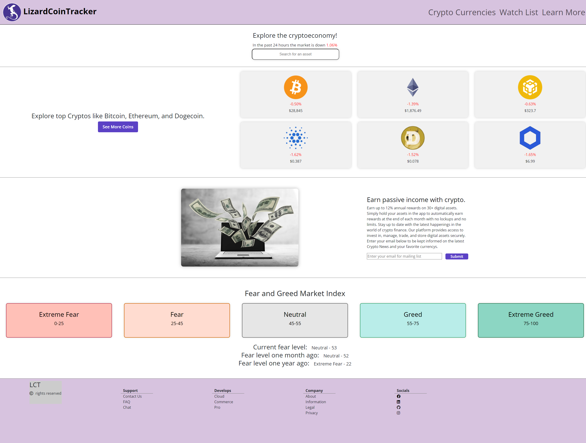
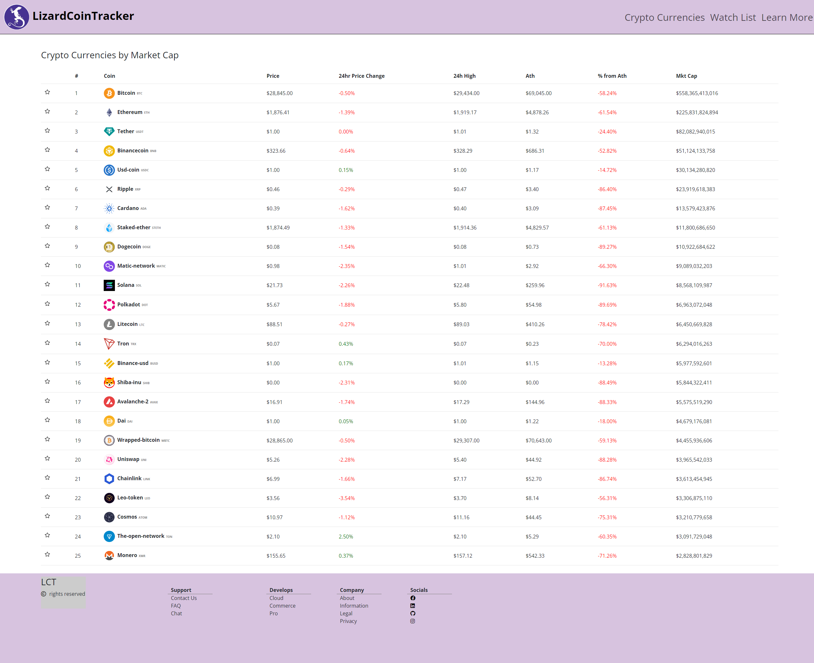
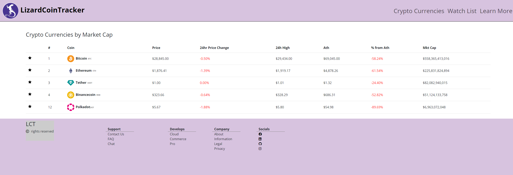

# Lizard-Coin-Tracker

## Description

Introducing a cutting-edge Cryptocurrency platform that offers a comprehensive range of features for crypto enthusiasts and traders alike. Our platform offers an intuitive user interface that provides real-time information on a wide range of coins and tokens, enabling users to track their investments with ease.

With our platform, users can monitor various metrics of their favorite coins, from market capitalization to price movements, and more. They can also create a personalized watchlist to keep an eye on the coins they are interested in.

In addition, our platform offers extensive resources for learning about cryptocurrency, including educational materials and in-depth analysis of the industry. Whether you're a seasoned trader or a newcomer to the crypto world, our platform is designed to help you stay ahead of the curve.

To help users gauge market sentiment, our platform also features a fear and greed index that provides insights into the current conditions of the market. This valuable feature can help users make informed decisions about their investments.

At our platform, we are committed to providing a reliable and secure platform for crypto enthusiasts to explore, learn, and invest in the world of cryptocurrency.

## License

Please refer to the LICENSE in the repo.

## Webpage Preview

The homepage of our platform, offering a clean and intuitive interface for users to access all of our features.

The Cryptocurrency page of our platform, providing real-time data and metrics for various coins and tokens.

The Watchlist page of our platform, allowing users to create a personalized list of their favorite coins and track them easily.

Discover the essentials of crypto with our informative Learn page, featuring educational resources and industry analysis to keep you up-to-date.

## Contributors

I would like to thank the following individuals for their contributions to this project:

-   Connor G ([GitHub](https://github.com/connorg45))
-   Larissa S ([GitHub](https://github.com/RissaStack))
-   Ali B ([GitHub](https://github.com/alihumzahbeig))

# Links

[Deployed Website]()

[Github Repo](https://github.com/RissaStack/Lizard-Coin-Tracker)
